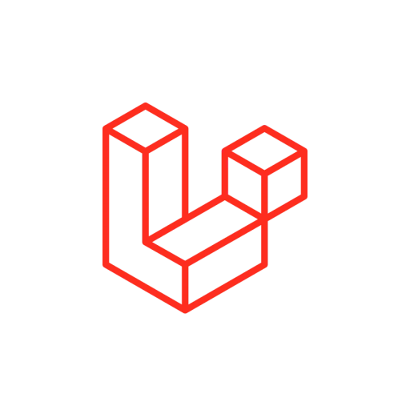

# Laravel Documentation for Raycast

The ultimate Laravel developer toolkit for Raycast. Quickly access documentation, browse Artisan commands, copy code snippets, create new projects, and run commands—all without leaving your keyboard.



## Features

### 📚 Search Laravel Docs

Instantly search and browse the official Laravel documentation:

- **68 documentation pages** organized into 10 categories:
  - Prologue (Release Notes, Upgrade Guide, Contribution Guide)
  - Getting Started (Installation, Configuration, Directory Structure, Frontend, Starter Kits, Deployment)
  - Architecture Concepts (Request Lifecycle, Service Container, Service Providers, Facades)
  - The Basics (Routing, Middleware, CSRF, Controllers, Requests, Responses, Views, Blade, Vite, URLs, Session, Validation, Errors, Logging)
  - Digging Deeper (Artisan, Broadcasting, Cache, Collections, Events, Filesystem, Helpers, HTTP Client, Localization, Mail, Notifications, Packages, Processes, Queues, Rate Limiting, Strings, Scheduling)
  - Security (Authentication, Authorization, Email Verification, Encryption, Hashing, Password Reset)
  - Database (Getting Started, Query Builder, Pagination, Migrations, Seeding, Redis, MongoDB)
  - Eloquent ORM (Getting Started, Relationships, Collections, Mutators/Casts, API Resources, Serialization, Factories)
  - Testing (Getting Started, HTTP Tests, Console Tests, Browser Tests, Database Testing, Mocking)
  - Packages (Breeze, Cashier, Dusk, Envoy, Fortify, Folio, Homestead, Horizon, Livewire, Mix, Octane, Passport, Pennant, Pint, Precognition, Prompts, Pulse, Reverb, Sail, Sanctum, Scout, Socialite, Telescope, Valet)
- **17 Laravel versions** supported (Master through 5.0)
- **Favorites system** to bookmark your most-used pages
- **Recent pages** tracking for quick access
- **Laracasts integration** with direct links to video tutorials

### ⚡ Artisan Commands Reference

Browse **56 Laravel Artisan commands** organized into 9 categories:

- **Make** (26 commands) - Controllers, Models, Migrations, Seeders, Factories, Middleware, Requests, Resources, Commands, Events, Listeners, Jobs, Mail, Notifications, Policies, Providers, Tests, Components, Livewire, Casts, Channels, Exceptions, Observers, Rules, Scopes
- **Database** (7 commands) - migrate, migrate:fresh, migrate:rollback, migrate:reset, migrate:status, db:seed, db:wipe
- **Cache** (10 commands) - cache:clear, config:cache/clear, route:cache/clear, view:cache/clear, event:cache, optimize, optimize:clear
- **Development** (5 commands) - serve, tinker, route:list, env, about
- **Queue** (6 commands) - work, listen, restart, failed, retry, flush
- **Schedule** (3 commands) - run, list, work
- **Auth** (2 commands) - key:generate, storage:link
- **Packages** (2 commands) - vendor:publish, package:discover

Copy any command with usage examples to your clipboard instantly.

### 📝 Laravel Snippets

Access **32 ready-to-use code snippets** across 9 categories:

- **Routes** (6 snippets) - Basic routes, controller routes, resource routes, API routes, route groups, route parameters
- **Controllers** (3 snippets) - Controller methods, store with validation, API responses
- **Models** (6 snippets) - Fillable attributes, HasMany, BelongsTo, BelongsToMany relationships, scopes, accessors
- **Migrations** (3 snippets) - Create tables, add columns, drop columns
- **Blade** (4 snippets) - Layouts, components, conditionals, loops
- **Validation** (2 snippets) - Form request rules, custom messages
- **Middleware** (1 snippet) - Handle method
- **Testing** (2 snippets) - Feature tests, authenticated tests
- **Queries** (3 snippets) - Eloquent queries, eager loading, pagination

### 🚀 Create Laravel Project

Create new Laravel projects directly from Raycast:

- Choose your **starter kit** (None, Breeze, or Jetstream)
- Select your preferred **database** (SQLite, MySQL, PostgreSQL, SQL Server)
- Configure **Git initialization**
- Opens the project folder automatically when complete

### 🔧 Run Artisan Commands

Execute common Artisan commands in your Laravel project:

- **Common** (3 commands) - Serve, Tinker, Route List
- **Database** (5 commands) - Migrate, Fresh, Fresh + Seed, Seed, Rollback
- **Cache** (5 commands) - Clear All, Cache Config, Cache Routes, Cache Views, Clear Cache
- **Queue** (3 commands) - Work, Listen, Restart
- **Testing** (2 commands) - Run Tests, Run Tests (Parallel)

## Installation

1. Open Raycast
2. Search for "Laravel Documentation" in the Store
3. Click Install

Or install manually:

```bash
git clone https://github.com/your-username/laravel-documentation.git
cd laravel-documentation
npm install
npm run dev
```

## Configuration

Open Raycast preferences (`⌘ + ,`) and configure:

| Preference                    | Description                             | Default       |
| ----------------------------- | --------------------------------------- | ------------- |
| **Laravel Version**           | Which version's documentation to browse | 12.x (Latest) |
| **Always open in new tab**    | Open docs in browser vs copy URL        | Enabled       |
| **Laravel Project Directory** | Path for running Artisan commands       | -             |

## Usage

### Commands

| Command                  | Description                              |
| ------------------------ | ---------------------------------------- |
| `Search Laravel Docs`    | Search and browse 68 documentation pages |
| `Artisan Commands`       | Browse and copy 56 Artisan commands      |
| `Laravel Snippets`       | Copy 32 code snippets                    |
| `Create Laravel Project` | Start a new Laravel project with wizard  |
| `Run Artisan Command`    | Execute commands in your project         |

### Quick Actions

- **⌘ + ⏎** - Primary action (Open/Run/Copy)
- **⌘ + ⇧ + C** - Copy to clipboard
- **⌘ + F** - Add/remove from favorites
- **Open on Laracasts** - Search related video tutorials

## Supported Laravel Versions

| Version   | Status        |
| --------- | ------------- |
| Master    | Beta          |
| 12.x      | Latest        |
| 11.x      | LTS           |
| 10.x      | Supported     |
| 9.x       | Supported     |
| 8.x       | Security Only |
| 7.x - 5.0 | Legacy        |

## Requirements

- [Raycast](https://raycast.com/) (macOS/Windows)
- For "Create Laravel Project": [Laravel Installer](https://laravel.com/docs/installation#the-laravel-installer) or Composer
- For "Run Artisan": PHP and a Laravel project

## Contributing

Contributions are welcome! Please feel free to submit a Pull Request.

## License

MIT License - see [LICENSE](LICENSE) for details.

## Author

Created by **jasper_huppertz**

---

Made with ❤️ for the Laravel community
